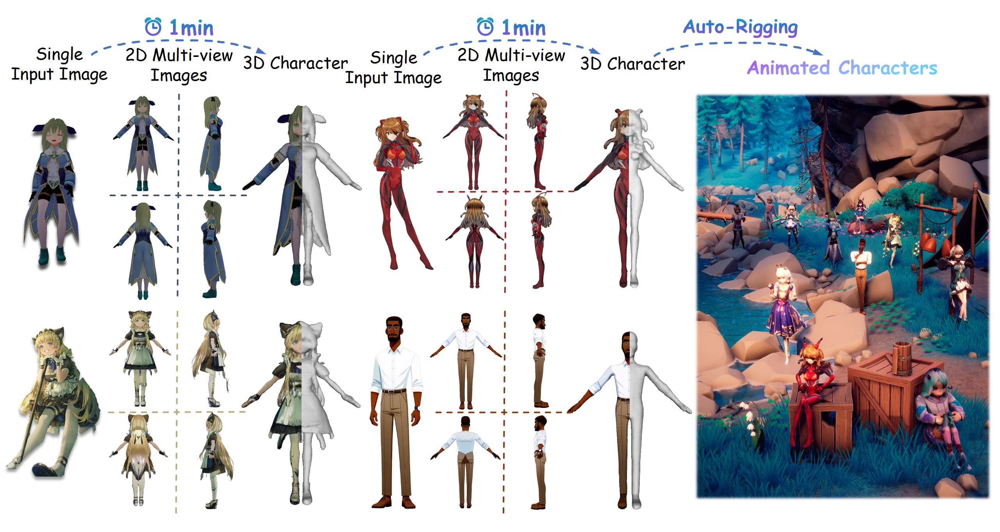
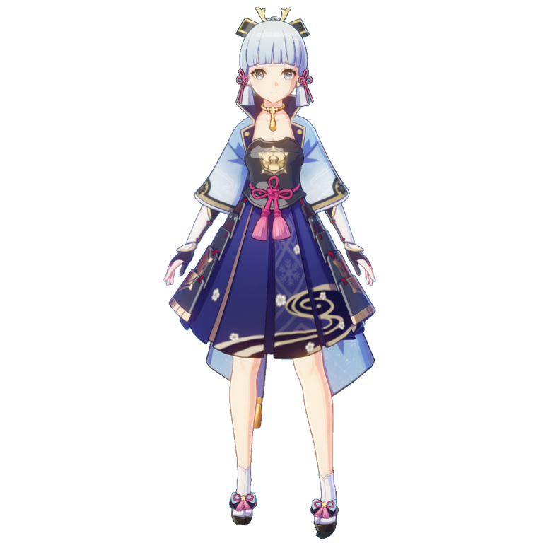
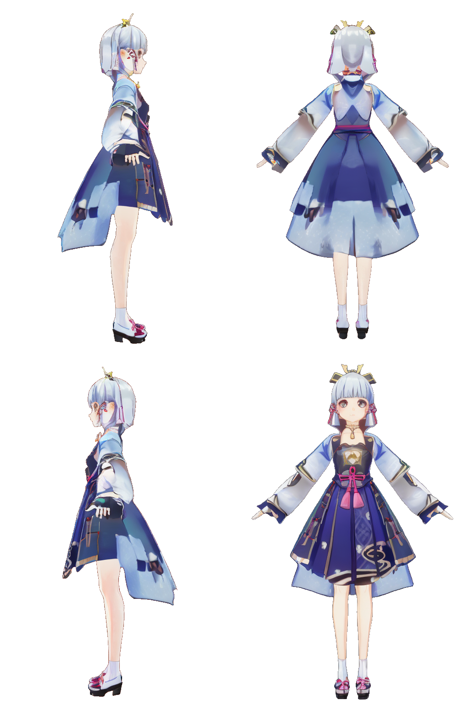
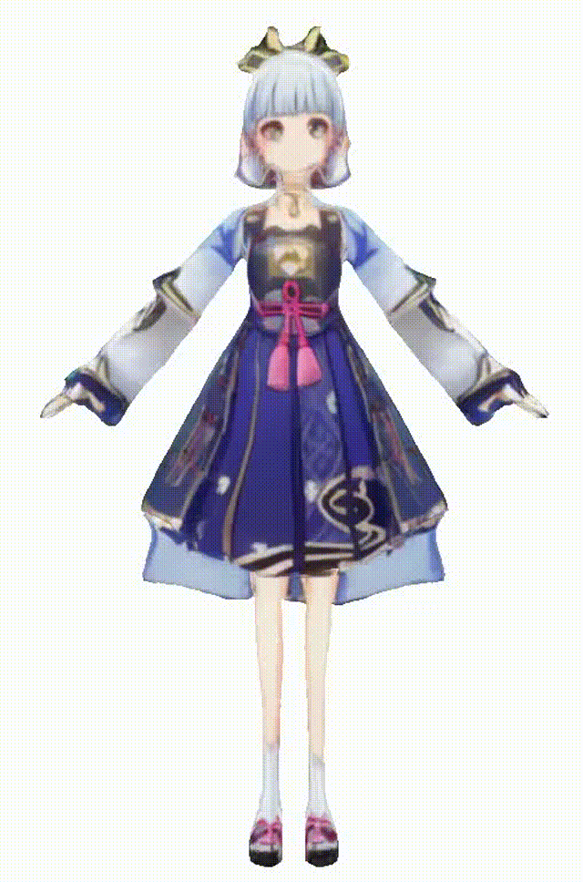
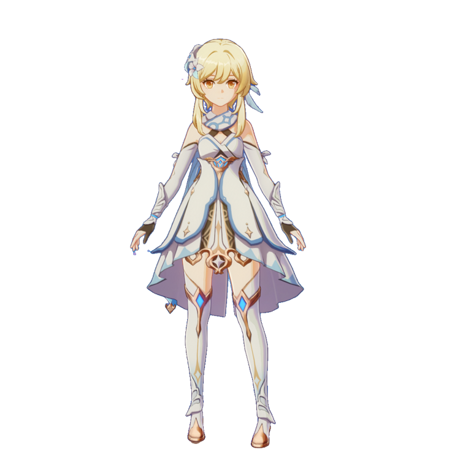
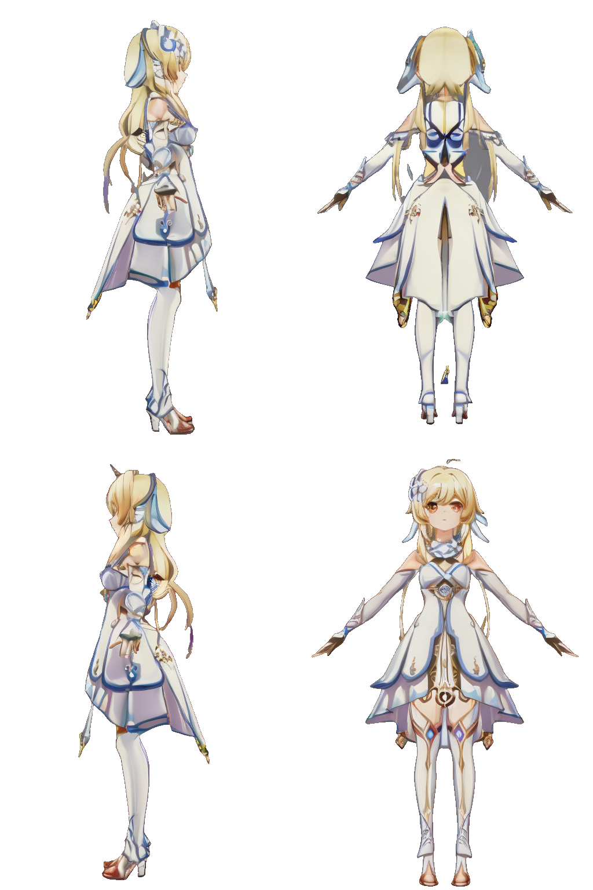
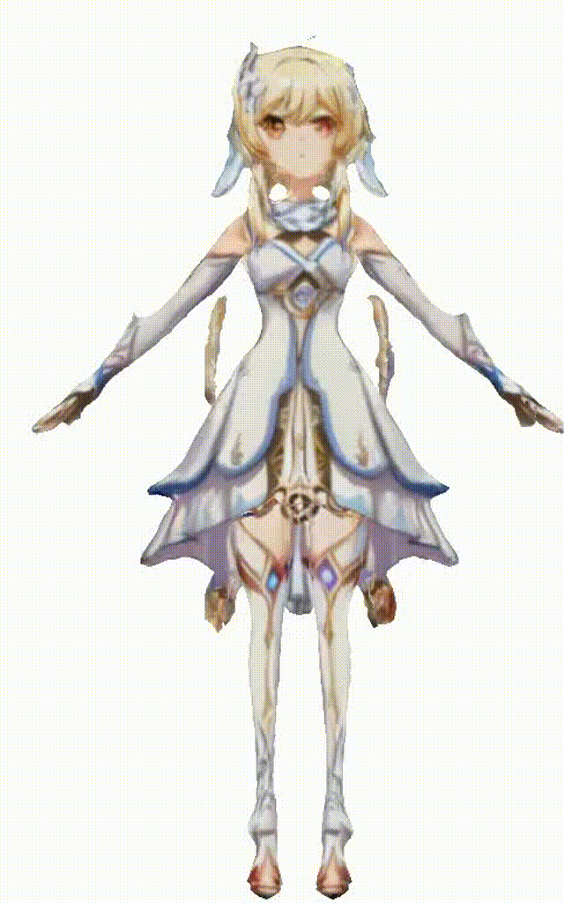
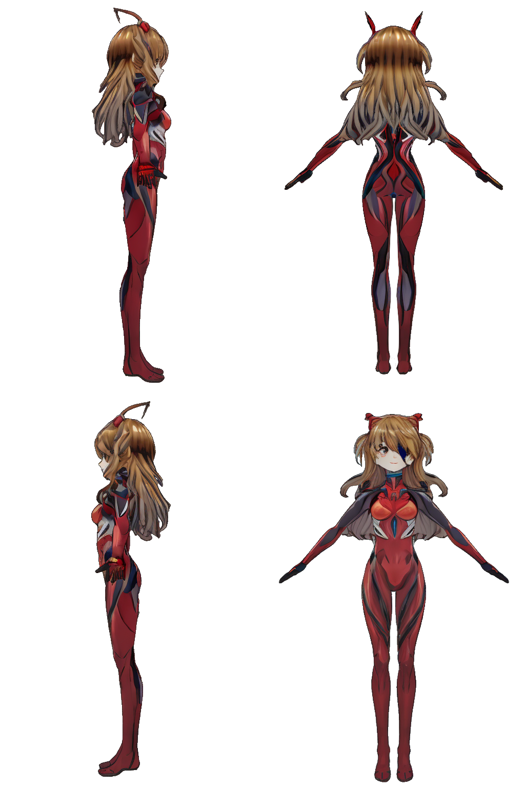
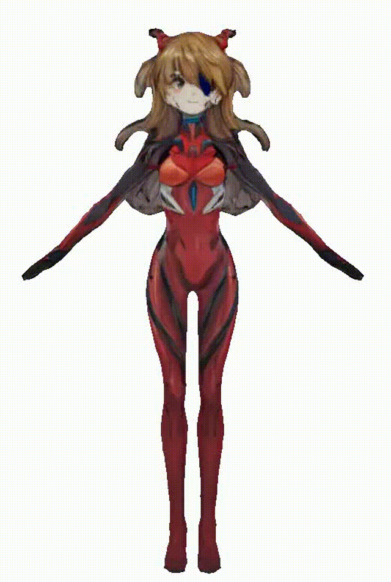

# CharacterGen: Efficient 3D Character Generation from Single Images with Multi-View Pose Calibration

This is the codebase of SIGGRAPH'24 (TOG) [CharacterGen](https://charactergen.github.io/).



- [x] Rendering Script of VRM model, including blender and three-js.
- [x] Inference code for 2D generation stage.
- [x] Inference code for 3D generation stage.

## Quick Start

### 1. Prepare environment

Use `python3.9` and then
`pip install -r requirements.txt`

### 2. Run the script

#### Run the whole pipeline

```bash
python webui.py
```

This script will download the weight automatically. 
You can also use `huggingface-cli` to download the weight manually.

```bash
huggingface-cli download --resume-download zjpshadow/CharacterGen --include 2D_Stage/* --local-dir .
huggingface-cli download --resume-download zjpshadow/CharacterGen --include 3D_Stage/* --local-dir .
```

If you find mistakes on download, you can download all the reporitory and move to the right folder.

#### Only Run 2D Stage

```bash
cd 2D_Stage
python webui.py
```

#### Only Run 3D Stage

```bash
cd 3D_Stage
python webui.py
```

## Get the Anime3D Dataset

Due to the policy, we cannot redistribute the raw data of VRM format 3D character.
You can download the vroid dataset follow [PAniC-3D](https://github.com/ShuhongChen/panic3d-anime-reconstruction) instruction.
And the you can render the script with blender or three-js with our released rendering script.

### Blender

First, you should install  [Blender](https://www.blender.org/) and  [the VRM addon for Blender](https://github.com/saturday06/VRM-Addon-for-Blender).

The you can render the VRM and export the obj of VRM under some fbx animation.

```bash
blender -b --python render_script/blender/render.py importVrmPath importFbxPath outputFolder [is_apose]
```

The last input argument represents whether you use apose; if used, output apose; otherwise, output the action of any frame in the fbx.

### [three-vrm](https://github.com/pixiv/three-vrm)

**Much quicker than blender VRM add-on.**

Install [Node.js](https://nodejs.org/) first to use the npm environment.

```bash
cd render_script/three-js
npm install three @pixiv/three-vrm
```

If you want to render depth-map images of VRM, you should replace three-vrm with [my version](/home/zjp/CharacterGen/render_script/three-js/src/three-vrm.js).

Fisrt, run the backend to catch the data from the frontend (default port is `17070`), remember to change the folder path.

```bash
pip install fastapi uvicorn aiofiles pillow numpy
python up_backend.py
```

Second, run the frontend to render the images.

```bash
npm run dev
```

The open the website http://localhost:5173/, it use 2 threads to render the image, which costs about 1 day.

## Our Result

| Single Input Image | 2D Multi-View Images | 3D Character |
|-------|-------|-------|
|  |  |  |
|  |  |  |
|  |  |  |

# Acknowledgements

This project is built upon **[Tune-A-Video](https://github.com/showlab/Tune-A-Video)** and **[TripoSR](https://github.com/VAST-AI-Research/TripoSR)**.
And the rendering scripts is build upon **[three-vrm](https://github.com/pixiv/three-vrm)** and **[VRM-Addon-for-Blender](https://github.com/saturday06/VRM-Addon-for-Blender)**.
Thanks very much to many friends for their unselfish help with our work. We're extremely grateful to **[Yuanchen](https://github.com/bennyguo)**, **[Yangguang](https://scholar.google.com/citations?user=a7AMvgkAAAAJ)**, and **Yuan Liang** for their guidance on code details and ideas.
We thank all the authors for their great repos and help.

# Citation

If you find our code or paper helps, please consider citing:

```bibtex
@article{peng2024charactergen,
  title   ={CharacterGen: Efficient 3D Character Generation from Single Images with Multi-View Pose Canonicalization}, 
  author  ={Hao-Yang Peng and Jia-Peng Zhang and Meng-Hao Guo and Yan-Pei Cao and Shi-Min Hu},
  journal ={ACM Transactions on Graphics (TOG)},
  year    ={2024},
  volume  ={43},
  number  ={4},
  doi     ={10.1145/3658217}
}
```
